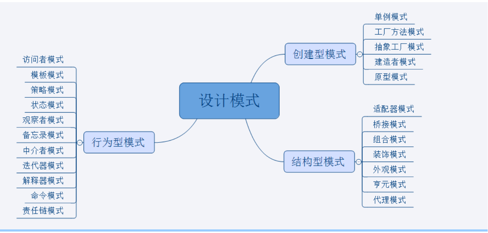

<!-- 下面的行需要是一个空行C :(因为kramdown不是
     聪明而且非常想在标题之前想要一条空行
     如此显示它，例如网站) -->

# Design patterns implemented in Java

# Introduction

设计模式是程序员可以使用的形式化最佳实践
在设计应用程序或系统时解决常见问题。

设计模式可以通过提供经过测试和验证的方式加速开发过程
发展范式。

重用设计模式有助于防止可能导致重大问题的细微问题
问题，它还提高了编码人员和架构师的代码可读性
熟悉模式。

# Getting started

在深入研究材料之前，您应该熟悉各种材料
[Programming/Software Design Principles](http://webpro.github.io/programming-principles/).

所有设计都应尽可能简单。你应该从KISS，YAGNI开始，
并做最简单的事可能工作原则。复杂性和
只有在实际需要时才应引入模式
可扩展性。

一旦熟悉了这些概念，就可以开始深入研究了这些概念
通过以下任何方法的模式

 - Using difficulty tags, `Difficulty-Beginner`, `Difficulty-Intermediate` & `Difficulty-Expert`.
 - Using pattern categories, `Creational`, `Behavioral` and others.
 - Search for a specific pattern. Can't find one? Please report a new pattern [here](https://github.com/iluwatar/java-design-patterns/issues).

# How to contribute

如果您愿意为项目做出贡献，您可以在我们的网站上找到相关信息 [developer wiki](https://github.com/iluwatar/java-design-patterns/wiki). We will help you and answer your questions in the [Gitter chatroom](https://gitter.im/iluwatar/java-design-patterns).

# License

该项目根据MIT许可条款获得许可。

# image
