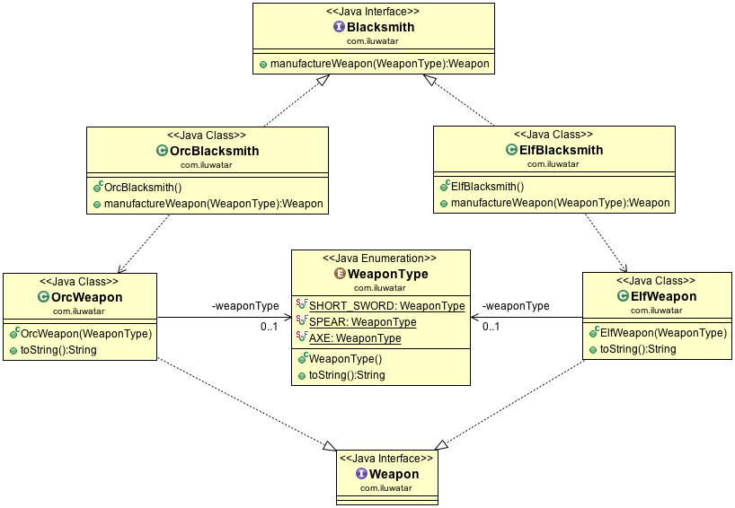

## Also known as
Virtual Constructor
虚拟构造函数

## Intent
定义用于创建对象的接口，但是让子类
决定实例化哪个类。工厂方法允许班级推迟
实例化到子类。

## 适用性
使用Factory Method模式时

* 类无法预测它必须创建的对象类
* 一个类希望它的子类指定它创建的对象
* 类将责任委托给几个辅助子类之一，并且您希望本地化哪个辅助子类是委托的知识

## Credits

* [Design Patterns: Elements of Reusable Object-Oriented Software](http://www.amazon.com/Design-Patterns-Elements-Reusable-Object-Oriented/dp/0201633612)
